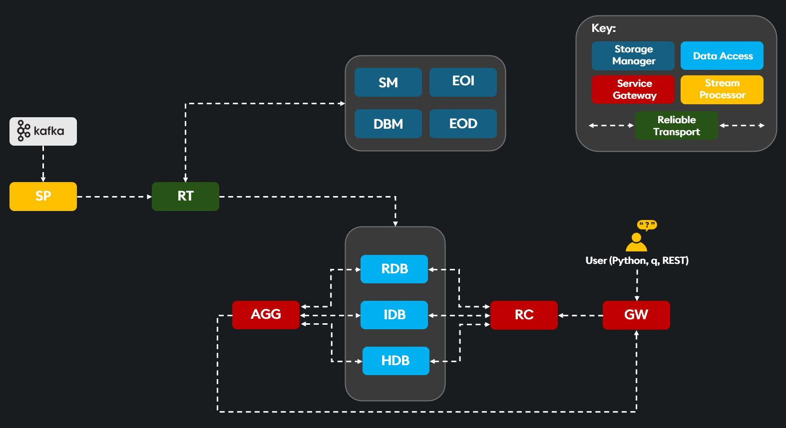
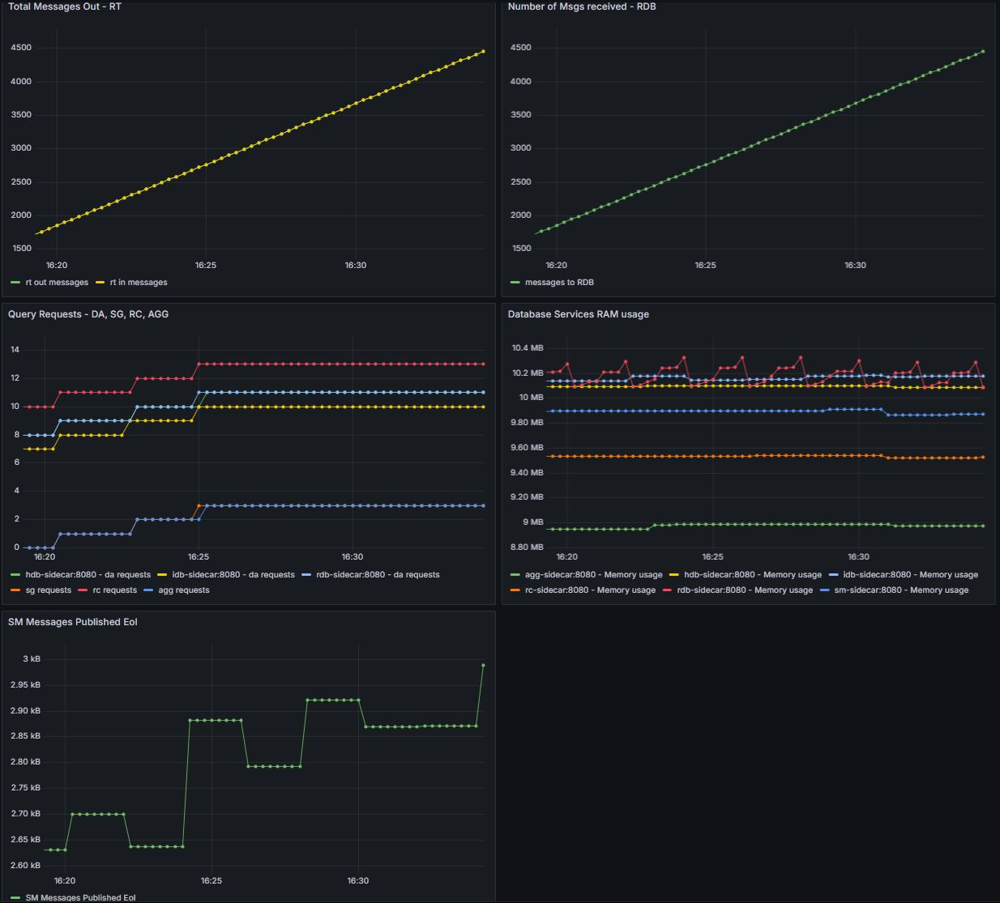

# kdb Insights Runbook 🚀

Follow this runbook to create a local docker deployment of Insights SDK Microservices.

The deployment will consume a live Kafka stream of synthetic capital markets data (trades & quotes) through a [Stream Processor](https://code.kx.com/insights/1.13/microservices/stream-processor/index.html) (SP) into a kdb Insights Microservices architecture via [Reliable Transport](https://code.kx.com/insights/1.13/microservices/rt/index.html) (RT), as opposed to a tickerplant, to resiliantly transport data into and between the microservices.

You will learn to:
- Setup your environment to run kdb Insights Microservices
- Deploy a microservices architecture
- Deploy and view Grafana metrics
- Publish data (csv & Kafka stream)
- Query with q and through the KXI CLI with SQL
- Run custom UDAs (APIs)
- View logs

## Architecture Diagram 🏗️



---

## Metrics 📊



---

## Links 🔗

-   [Microservices](https://code.kx.com/insights/microservices) 

---

## Setup 🛠️

1.  Clone the [Insights Runbook](https://github.com/RyanSieglerKX/runbook-kdb-insights) into your environment (like Linux or wsl), for example into the `/home` directory.
    ```bash
    cd /home/runbook-kdb-insights
    ```
2.  Setup the repository:
    ```bash
    mkdir -p data/db data/logs lic
    chmod 777 -R data
    ```
3.  Sign-up for [Insights SDK Free Trial](https://kx.com/kdb-insights-sdk-personal-edition-download/): Follow emailed instructions to download your license file.
4.  Copy your license file into the `./lic` directory.
    ```bash
    cp /path/to/k[4,c,x].lic lic/
    ```
5.  [Install KXI CLI](https://code.kx.com/insights/1.13/enterprise/cli/install.html) (Recommend using `uv` method).
6.  Configure KXI CLI:
    To use the _kdb Insights CLI_ replace the contents of `~/.insights/cli-config` with:
    ```ini
    [default]
    usage = microservices
    hostname = http://localhost:8080
    ```
7.  Ensure [Docker](https://www.docker.com/products/docker-desktop/) is installed and running with the WSL integration setting enabled.
8.  Ensure you have access to the KX Docker repo (`portal.dl.kx.com`) and generate a token.
9.  Log in to the KX Docker repository:
    ```bash
    docker login portal.dl.kx.com -u <user> -p <bearer token>
    ```
10. (If you want to query and call APIs with q): Install kdb+/q: [https://code.kx.com/q/learn/install/](https://code.kx.com/q/learn/install/)

    In a cli like a wsl terminal:
    ```bash
    export QHOME=~/q
    export PATH=~/q/l64/:$PATH
    ```
In your terminal, `$ q` will open a q interactive session, `q) \\` will exit the q session. 

Now we are set up to build the kdb architecture with microservices!

**Tip:** It will be helpful to open several WSL terminals, all at the `/home/runbook-kdb-insights` directory. Use separate WSL terminals to run each of the Docker compose files (compose, compose-metrics, compose-stream), and have another terminal open for running queries and viewing logs.

---

## Build the main microservices architecture 🧱

(using `compose.yaml`):
```bash
docker compose up --build
```

## Metrics
```bash
docker compose --env-file ./.env -f compose-metrics.yaml up --build
```

Now you can open the Grafana metrics dashboard in your local browser: `localhost:3000`

Set the refresh rate to 5 seconds in the upper right corner of the dashboards. It will take a few seconds for metrics to show up.

Keep the metrics dashboards up in a separate window so you can see the live metrics as you work through the runbook.

## Basic Architecture Querying & Publishing
#### Query the DAP
```bash
kxi query --sql 'SELECT * FROM trade'
```

#### Publish one row to trade table:
```bash
kxi publish --mode rt --file-format csv --table trade --data config/trade.csv --endpoint :localhost:5002
```

#### Query the DAP to see the published row
```bash
kxi query --sql 'SELECT * FROM trade'
```

## Stream Processing
#### Start Stream Processor with Kafka feed:
```bash
docker compose --env-file ./.env -f compose-stream.yaml up --build
```

You should see some interesting changes in your metrics dashboards a few seconds after starting the SP!

#### Query the trade table to see the data flowing (try running this multiple consecutive times):
```bash
kxi query --sql 'SELECT count(*) FROM trade'
```

## Custom API / [UDA](https://code.kx.com/insights/1.13/api/database/uda/how-to-uda-overview.html) (User Defined Analytics)

#### List the available [packages](https://code.kx.com/insights/1.13/api/packaging/) (This is where our custom APIs are defined):
```bash
kxi package list
```

In the custom package there are two UDAs (view the code in ./config/packages/custom/1.0.0/):
- .example.daAPI : A simple function that multiplies a specified column in a given table by a multiplier
- .custom.aj : Performs an aj (as-of join) between the trades and quotes table for a given symbol.

#### Run a simple sample API:
```bash
curl -X POST http://localhost:8080/example/daAPI   -H 'Content-Type: application/json'   -d '{
    "table": "trade",
    "column": "price",
    "multiplier": 10
  }'
```

#### Run a As-Of join API:
```bash
curl -X POST http://localhost:8080/custom/aj   -H 'Content-Type: application/json'   -d '{
    "tradesTable": "trade",
    "quotesTable": "quote",
    "sym": "AAPL"
  }'
```


## Query in q
To interact with the system using q (if you have q installed via step 10 in the setup):
```bash
q) gw:hopen `:localhost:5050
\\ Query
q) gw(`.kxi.sql;enlist[`query]!enlist"SELECT * FROM trade WHERE (sym = 'AAPL')";`;(0#`)!())
\\ Custom API
q) gw(`.custom.aj;(`tradesTable;`quotesTable;`sym)!(`trade;`quote;`AAPL);`;(0#`)!())
```

## View Logs
To view logs for different components:
- RT logs:
```bash
docker compose logs -f kxi-rt
```
- SM logs:
```bash
docker compose logs -f kxi-sm
```
- DA logs:
```bash
docker compose logs -f kxi-da
```
- SP logs:
```bash
docker compose logs -f sp-worker
```

## Shutdown
When restarting, it is helpful to shutdown and remove old containers including the metrics and stream processor containers:
```bash
docker compose down --remove-orphans
```

## Reset the System
This will wipe out all data in the data directory. ONLY DO THIS AFTER SHUTTING DOWN ALL CONTAINERS/SERVICES.
```bash
./RESET_DB.sh
```

## Community & Ask Questions
Join our Slack community to ask questions and for great networking at [kx.com/slack](kx.com/slack)